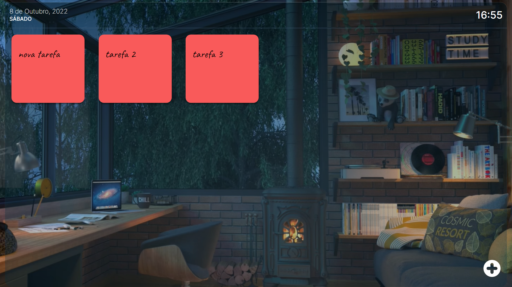

# My Tasks

A CRUD system inspired by a to-do list that counts with a dating system and clock.

## 🛠️ Technologies

* [Nodejs](https://nodejs.org/en/) - Node.js
* [Mongodb](https://www.mongodb.com/) - Mongo.db
* [HTML](https://developer.mozilla.org/en-US/docs/Web/HTML) - HTML
* [CSS](https://developer.mozilla.org/en-US/docs/Web/CSS) - CSS
* [Javascript](https://developer.mozilla.org/en-US/docs/Web/JavaScript) - JAVASCRIPT
* [EJS](https://ejs.co/) - EJS

##  The users should be able to:

* Add, edit and delete notes;
* Check the current date and time

##  Difficulties

By far the hardest project I've done so far. 

The hardest part was implementing the system to make the edit and annotation screens appear. I was able to manipulate the display properties of these respective components with javascript.

Clicking on the add button you activate a function that changes the display from 'none' to 'flex', causing the screen to add a new task to appear. As for editing, I used tags inside the ejs file to bring up the editing screen with the display set to flex, while in css, its initial value is none.
